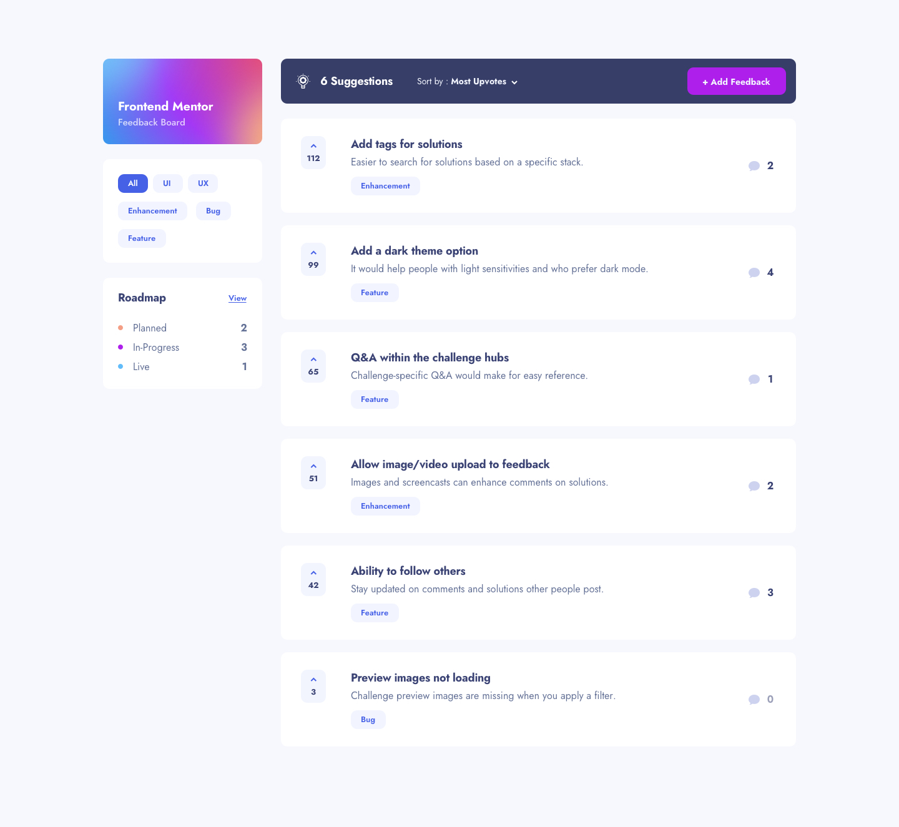

<h1 style="text-align: center">Prodback (WIP)</h1>



<p style="text-align: center">
This is a challenge from Frontend Mentor. Here's the <a href="https://www.frontendmentor.io/challenges/product-feedback-app-wbvUYqjR6">Link</a>
</p>

<p>
>>>
<a href="https://prodback.vercel.app/">Link for live project</a>
</p>

## Techonologies

The challenge provide the data from a .json file, but i've decided to use mongodb to persist data. So the technologies used in this project are:

-   Nextjs 13
-   SASS modules
-   MongoDB
-   Typescript

## How to run

If you wanna run this project, just clone it and run on the directory root:

```
npm install
```

and then:

```
npm run dev
```

## Important

Since this project uses mongoDB to persist data, you'll need an Atlas account. So, create one and provide the following variables on your .env file:

-   MONGO_URI

After that you'll be alble to run this project and see it on the following url:

```
http://127.0.0.1:3000
```
